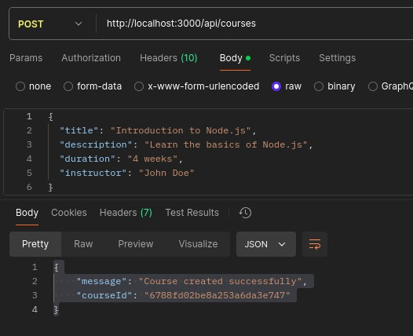
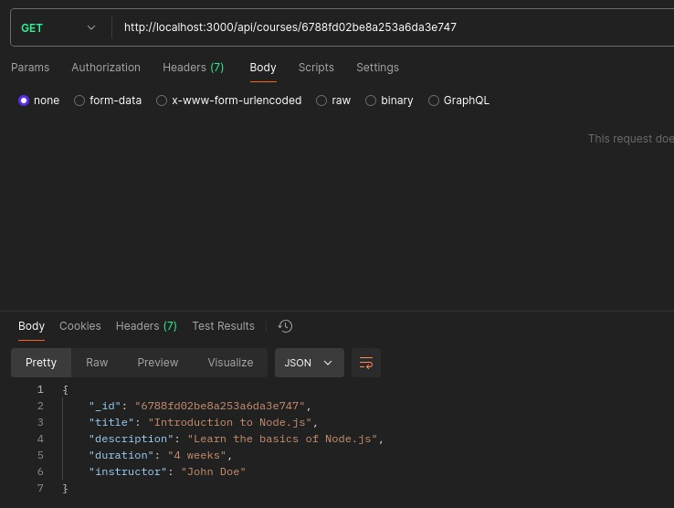
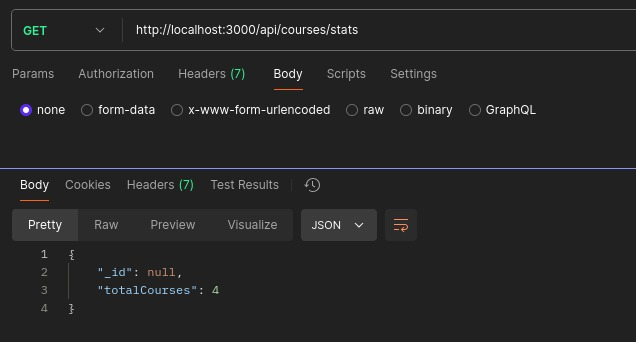

# Plateforme d'Apprentissage NoSQL

## Aperçu du Projet
Pour ce projet, vous allez créer une petite API qui va servir de backend à une plateforme d'apprentissage en ligne. J'ai préparé la structure du projet avec une organisation professionnelle du code, comme vous pouvez le constater dans ce dépôt Github.

## Technologies Utilisées
- **Node.js** : Environnement d'exécution JavaScript côté serveur.
- **Express.js** : Framework web pour Node.js.
- **MongoDB** : Base de données NoSQL orientée documents.
- **Redis** : Base de données NoSQL en mémoire, utilisée comme cache.
- **dotenv** : Module pour charger les variables d'environnement à partir d'un fichier `.env`.

## Questions et Réponses
Question : Pourquoi créer un module séparé pour les connexions aux bases de données ?
Réponse : Créer un module séparé pour les connexions aux bases de données permet de centraliser et de réutiliser le code de connexion, de gérer les erreurs et les retries de manière cohérente, et de faciliter la maintenance et les tests.
Question : Comment gérer proprement la fermeture des connexions ?
Réponse : Pour gérer proprement la fermeture des connexions, il est important d'écouter les événements de fermeture de l'application (comme process.on('SIGINT')) et de fermer les connexions aux bases de données de manière appropriée en appelant les méthodes de fermeture fournies par les clients de base de données.


Question: Pourquoi est-il important de valider les variables d'environnement au démarrage ?
Réponse : Valider les variables d'environnement au démarrage est crucial pour s'assurer que l'application dispose de toutes les configurations nécessaires pour fonctionner correctement. Cela permet de détecter les erreurs de configuration tôt et d'éviter des comportements imprévisibles ou des échecs en cours d'exécution.
Question: Que se passe-t-il si une variable requise est manquante ?
Réponse : Si une variable requise est manquante, l'application doit lever une erreur explicative et arrêter son exécution. Cela permet de signaler immédiatement le problème de configuration et d'éviter des erreurs difficiles à diagnostiquer plus tard.


Question: Quelle est la différence entre un contrôleur et une route ?
Réponse: Une route est une URL spécifique qui correspond à une action dans une application web, tandis qu'un contrôleur est une fonction ou un ensemble de fonctions qui gèrent les requêtes HTTP pour ces routes. Les routes définissent les points d'entrée de l'application, et les contrôleurs contiennent la logique métier pour traiter les requêtes et générer les réponses.
Question : Pourquoi séparer la logique métier des routes ?
Réponse : Séparer la logique métier des routes permet de rendre le code plus modulaire, maintenable et testable. Les routes se concentrent sur le routage des requêtes, tandis que les contrôleurs gèrent la logique métier. Cela facilite également la réutilisation du code et la gestion des dépendances.


Question: Pourquoi séparer les routes dans différents fichiers ?
Réponse : Séparer les routes dans différents fichiers permet de mieux organiser le code, de le rendre plus lisible et maintenable. Cela facilite également la gestion des routes, surtout dans les grandes applications où il peut y avoir de nombreuses routes. Chaque fichier de routes peut se concentrer sur une fonctionnalité ou une ressource spécifique, ce qui améliore la modularité du code.
Question : Comment organiser les routes de manière cohérente ?
Réponse: Pour organiser les routes de manière cohérente, il est recommandé de regrouper les routes par fonctionnalité ou ressource. Utiliser des noms de fichiers et des structures de dossiers clairs et descriptifs. Par exemple, avoir un dossier routes avec des fichiers comme courseRoutes.js, userRoutes.js, etc. De plus, il est utile de suivre les conventions RESTful pour nommer les routes et les méthodes HTTP.


Question: Pourquoi créer des services séparés ?
Réponse: Créer des services séparés permet de centraliser et de réutiliser la logique métier et les interactions avec les bases de données. Cela rend le code plus modulaire, maintenable et testable. Les services peuvent être utilisés par différents contrôleurs ou autres parties de l'application, ce qui facilite la gestion des dépendances et la réutilisation du code.


Question : Comment gérer efficacement le cache avec Redis 
Réponse : Gérer efficacement le cache avec Redis implique de définir des stratégies de mise en cache ropriées, telles que l'expiration des clés (TTL), l'invalidation du cache lorsque les données sous-jacentes changent, et l'utilisation de structures de données Redis adaptées aux besoins de l'application. Il est également important de surveiller les performances et l'utilisation de la mémoire pour éviter les problèmes de surcharge.
Question: Quelles sont les bonnes pratiques pour les clés Redis ?
Réponse : Les bonnes pratiques pour les clés Redis incluent l'utilisation de noms de clés descriptifs et hiérarchiques (par exemple, user:123:profile), l'ajout de préfixes pour éviter les collisions de noms, et la définition de TTL pour les données temporaires afin de libérer la mémoire automatiquement. Il est également recommandé de compresser les données volumineuses et de surveiller l'utilisation de la mémoire.


Question: Comment organiser le point d'entrée de l'applicatio
Reponse : Organiser le point d'entrée de l'application implique de configurer les connexions aux bases données, de configurer les middlewares Express, de monter les routes, et de démarrer le serveur. Il est également important de gérer proprement l'arrêt de l'application pour fermer les connexions aux bases de données.
Question: Quelle est la meilleure façon de gérer le démarrage de l'application ?
Reponse : La meilleure façon de gérer le démarrage de l'application est d'utiliser une fonction asynchrone pour initialiser les connexions aux bases de données, configurer les middlewares, monter les routes, et démarrer le serveur. En cas d'erreur, il est important de capturer et de gérer les erreurs pour éviter que l'application ne démarre dans un état incohérent.


Question: Quelles sont les informations sensibles à ne jamais commiter ?
Réponse : Les informations sensibles à ne jamais commiter incluent les clés API, les mots de passe, les informations de connexion aux bases de données, les jetons d'authentification, et toute autre information confidentielle qui pourrait compromettre la sécurité de l'application.

Question: Pourquoi utiliser des variables d'environnement ?
Réponse : Utiliser des variables d'environnement permet de séparer la configuration du code source, facilitant ainsi la gestion des différentes configurations pour les environnements de développement, de test et de production. Cela permet également de sécuriser les informations sensibles en les stockant en dehors du code source.


## Démo
### Prérequis
- Node.js et npm installés
- MongoDB et Redis installés et en cours d'exécution

### Installation
1. Clonez le dépôt :
   ```
   git clone https://github.com/votre-utilisateur/learning-platform-nosql.git
   cd learning-platform-nosql
   ```

2. Installez les dépendances :
```
   npm install
   ```

3. Configurez les variables d'environnement : Créez un fichier .env à la racine du projet et ajoutez les variables suivantes :
```
   PORT=3000
   MONGO_URI=mongodb://localhost:27017/learning_platform
   REDIS_HOST=127.0.0.1
   REDIS_PORT=6379
```

4. Démarrez le serveur :
```
   node src/app.js
```

### Utilisation de l'API
1. Ajouter un cours :


2. Afficher un cours :


3. Afficher l'etat des cours
